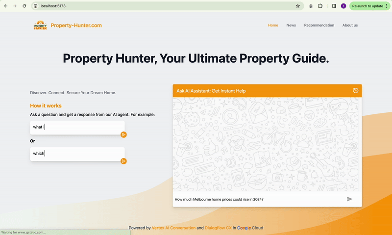
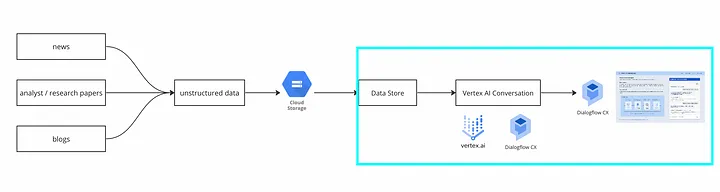

# Property Hunter

## 1. Introduction

Property Hunter is a web app that demonstrates the capabilities of
[Vertex AI Conversation](https://cloud.google.com/generative-ai-app-builder)
that is built on top of functionality in
[Dialogflow CX](https://cloud.google.com/dialogflow).



Using a Data Store Agent, you have the ability to input a website domain, structured data, or unstructured data, after which the Agent processes your content to generate a virtual agent fueled by data stores and extensive language models. This enables your customers and end users to engage in conversations with the agent, asking questions pertaining to the content provided.



For detailed information about how to set up the agent, please refer to this Medium article: [How to build your own AI Chatbot within 5 minutes using Google LLM and your private knowledge?](https://medium.com/@lizhuohang.selina/how-to-build-your-own-ai-chatbot-within-5-minutes-using-google-llm-and-your-private-knowledge-eed4b6852917)

## Steps to run the web app locally

1. Clone this repository
1. Run `yarn` to install the dependencies
1. Create a `.env` file in the root of the project and add the following
   environment variables:

   ```env
   VITE_PROJECT_ID=your-gcp-project-id
   VITE_AGENT_ID=your-agent-id
   ```

   Replace `your-gcp-project-id` and `your-agent-id` with the appropriate values.

   You can find these values in the Dialogflow CX console. For details, see the Medium article linked above.

1. Run `yarn dev` to start the development server

## Steps to deploy the web app to Firebase

1. Run `yarn build` to build the app
1. Navigate to the [Firebase console](https://console.firebase.google.com/)
1. Provision Firebase on a new or existing GCP project
1. In Firebase console, go to Hosting and add a new site (e.g.,
   `your-firebase-app-name`)
1. Install the [firebase CLI](https://firebase.google.com/docs/cli)
1. Delete the current `.firebaserc` file in the app root
1. Run `firebase init hosting` in the app root and follow the prompts, use the `build` directory, and confirm `N` to the followup
   questions about rewrites, deploys, and the 404 and index pages.
1. Run
   `firebase deploy --only hosting`

## Access the app

In your browser, navigate to the following URL to access the web app:

[Property Hunter](https://property-hunter-50022.web.app)

## Additional resources

You can continue learning about conversational AI and generative AI with
these guides and resources:

- [Overview of Vertex AI Conversation](https://cloud.google.com/generative-ai-app-builder/docs/agent-intro)
- [Create and use Data Store Agents](https://cloud.google.com/generative-ai-app-builder/docs/agent-usage)
- [Documentation for Dialogflow CX](https://cloud.google.com/dialogflow/cx/docs)
- [Documentation for Data Store Agents](https://cloud.google.com/dialogflow/cx/docs/concept/data-store-agent)
- [Generative AI in Google Cloud](https://cloud.google.com/ai/generative-ai)
